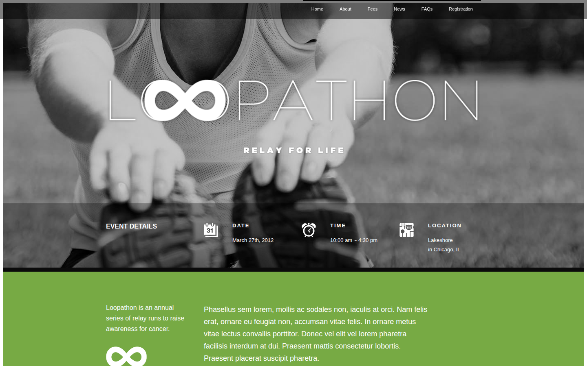
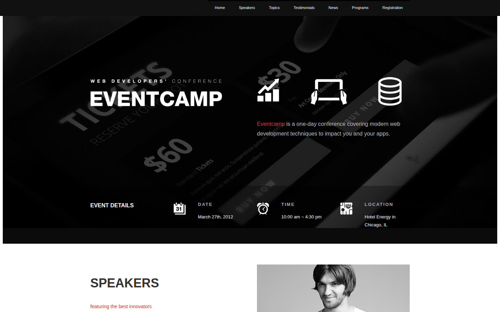
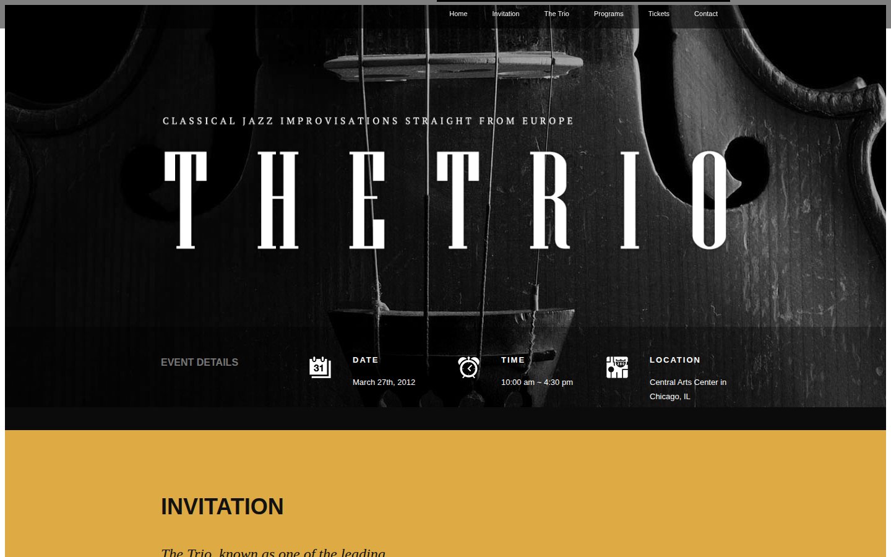

# Eventcamp templates

Eventcamp is a responsive event and conference website template, refreshed for
modern browsers while preserving the original visual design. It is available in
three color themes: **green**, **red**, and **yellow**.

## Downloads

Download the latest ready-to-use bundles from the
[Releases](https://github.com/subwaymatch/eventcamp/releases) page:

- `eventcamp-html-<version>.zip` — static HTML/CSS/JavaScript templates
- `eventcamp-php-<version>.zip` — PHP templates with the contact form

Each bundle contains all three themes and their image assets. The source tree
also includes the original Photoshop files.

## Preview

| Green | Red | Yellow |
| --- | --- | --- |
|  |  |  |

## Usage

1. Download a bundle or clone this repository.
2. Copy the desired theme from `templates-html/<theme>` to a web server for a
   static site, or use `templates-php/<theme>` on a PHP-enabled server.
3. Replace the sample content, images, and event details in `index.html` or
   `index.php`.
4. For the PHP contact form, configure
   `includes/include.emailSender.php` with a real recipient address and ensure
   the server has a configured `mail()` transport.

The templates use local CSS and JavaScript files plus HTTPS-loaded Google Fonts
and jQuery. No build step is required.

## Themes

- **Green** — classic event landing page with news and sponsor sections.
- **Red** — event landing page with speakers and topic highlights.
- **Yellow** — event landing page with player and schedule sections.

## License

Released under the [MIT License](LICENSE).
